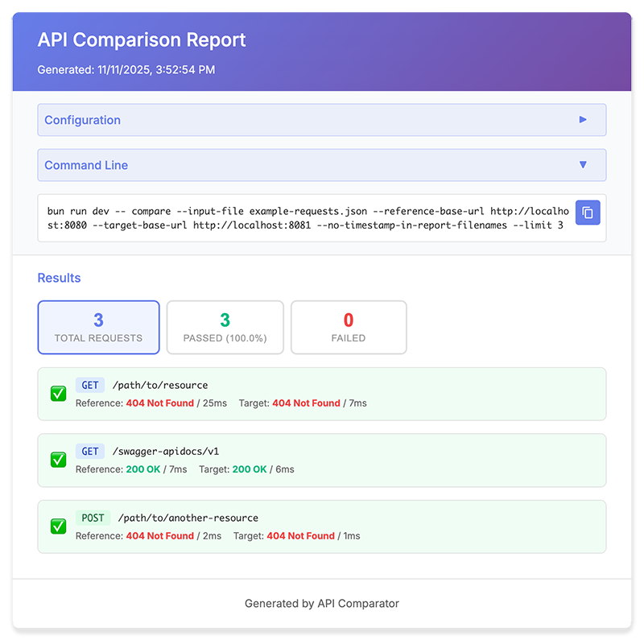

# API Comparator

A command-line tool built with Bun to compare API responses between reference and target environments. Perfect for testing API migrations, version upgrades, or comparing different deployment stages.



## Features

- 🔍 Compare API responses between two environments
- 📊 Status code comparison
- 📝 Normalized JSON body comparison
- ⏱️ Response time tracking
- 📄 Detailed JSON static HTML report generation
- 📋 Support input files in generic JSON format (default) and [Restfox](https://restfox.dev/) export format

## Installation

```bash
bun install
```

## Usage

### Compare APIs (generates JSON + HTML reports)

```shell
bun run dev -- compare \
  --input-file example-requests.json \
  --reference-base-url https://api-current.example.com \
  --target-base-url https://api-next.example.com
```

### With Custom Headers

Add headers to all reference and/or target requests:

```shell
bun run dev -- compare \
  --input-file example-requests.json \
  --reference-base-url https://api-current.example.com \
  --target-base-url https://api-next.example.com \
  --reference-headers "API-Key: xyz123, User-Agent: TestApp" \
  --target-headers "API-Key: abc456"
```

### Generate HTML Report from JSON

If you already have a JSON comparison report, you can generate just the HTML report:

```shell
bun run dev -- report \
  --input-file comparison-report-example-requests.json
```

The HTML report will be generated in the same directory as the JSON file with the same filename (just `.html` extension instead of `.json`).

### Command Actions

| Action | Description |
|--------|-------------|
| `compare` | Compare API responses and generate both JSON and HTML reports |
| `report` | Generate HTML report from an existing JSON comparison report |

### Command-Line Options

**For `compare` action:**

| Option | Description | Required |
|--------|-------------|----------|
| `--input-file <file>` | Path to the JSON request file | ✅ Yes |
| `--input-file-type <type>` | Type of input file: `generic` (default) or `restfox` | No |
| `--reference-base-url <url>` | Base URL for the current/reference API | ✅ Yes |
| `--target-base-url <url>` | Base URL for the next/target API | ✅ Yes |
| `--reference-headers <headers>` | Headers to add to all reference requests (format: "Header1: value1, Header2: value2") | No |
| `--target-headers <headers>` | Headers to add to all target requests (format: "Header1: value1, Header2: value2") | No |
| `--limit <number>` | Limit the number of URLs to compare | No |
| `--output-file <file>` | Output filename for reports (without extension) | No |
| `--output-dir <dir>` | Output directory for reports (default: current directory) | No |
| `--no-timestamp-in-report-filenames` | Omit timestamp from report filenames | No |
| `--normalized-json-comparison` | Use normalized JSON comparison (ignore key order) | No (default: false/strict) |

**For `report` action:**

| Option | Description | Required |
|--------|-------------|----------|
| `--input-file <file>` | Path to the JSON comparison report | ✅ Yes |
| `--output-file <file>` | Output filename for HTML report (with or without .html extension) | No |
| `--output-dir <dir>` | Output directory for HTML report (default: same as input file) | No |

**General options:**

| Option | Description |
|--------|-------------|
| `--help, -h` | Show help message |

## Input Format

The tool supports two input formats:

### 1. Generic JSON Format (Default)

A simple JSON array of request objects:

```json
[
  {
    "url": "https://api.example.com/users/123",
    "method": "GET"
  },
  {
    "url": "https://api.example.com/users",
    "method": "POST",
    "body": "{\"name\":\"John Doe\",\"email\":\"john@example.com\"}",
    "headers": {
      "Content-Type": "application/json",
      "Authorization": "Bearer token123"
    }
  }
]
```

**Fields:**
- `url` (optional): The full URL to request
- `referenceUrl` (optional): Specific URL for the reference environment
- `targetUrl` (optional): Specific URL for the target environment
- `method` (optional): HTTP method (default: GET)
- `body` (optional): Request body as a string
- `headers` (optional): Object with header key-value pairs
- `name` (optional): Display name for the request (defaults to URL)

**URL Handling:**
- The `{{baseUrl}}` placeholder is replaced with the respective base URLs in all URL fields (`url`, `referenceUrl`, `targetUrl`)
- If `referenceUrl` and `targetUrl` are provided, they are used for the respective environments
- If only `url` is provided, it's used for both environments with the respective base URL replacements

**Example with different URLs per environment:**
```json
[
  {
    "name": "Get User Profile",
    "method": "GET",
    "referenceUrl": "{{baseUrl}}/users/1",
    "targetUrl": "{{baseUrl}}/users/2"
  }
]
```

**Note:** Headers specified in the input file are merged with command-line headers (`--reference-headers` and `--target-headers`). Command-line headers take precedence if there's a conflict.

### 2. [Restfox](https://restfox.dev/) Export Format

Use `--input-file-type restfox` to parse [Restfox](https://restfox.dev/) export files. The tool reads the exported JSON file and extracts all HTTP requests with the following:

- Request method (GET, POST, PUT, PATCH, DELETE, etc.)
- URL with `{{baseUrl}}` placeholder support
- Request headers (with placeholder support)
- Request body (for POST/PUT/PATCH requests)
- Query parameters

Example Restfox export structure:
```json
{
  "exportedFrom": "Restfox-1.0.0",
  "collection": [
    {
      "_type": "request",
      "name": "Get User",
      "method": "GET",
      "url": "{{baseUrl}}/api/users/123",
      "body": {
        "mimeType": "No Body"
      }
    },
    {
      "_type": "request",
      "name": "Create User",
      "method": "POST",
      "url": "{{baseUrl}}/api/users",
      "body": {
        "mimeType": "application/json",
        "text": "{\"name\":\"John Doe\",\"email\":\"john@example.com\"}"
      }
    }
  ]
}
```

## Reports

### Reports Generated

The `compare` action generates **two reports**:

1. **JSON Report** - Machine-readable detailed comparison data
2. **HTML Report** - Static, self-contained, beautiful, interactive visual report

By default, both reports are timestamped (e.g., `comparison-report-Restfox_2025-11-11-2025-11-11T10-30-45-123Z.json` and `.html`). Use `--no-timestamp-in-report-filenames` to generate reports without timestamps in file names.

### JSON Report

A detailed JSON report is saved with a timestamp filename (e.g., `comparison-report-example-requests.json`).

### HTML Report

An interactive HTML report is also generated with the same timestamp. Features include:

- **Visual Dashboard** - Summary cards showing total, passed, and failed requests
- **Filter Tabs** - View all results, only passed, or only failed
- **Side-by-side Comparison** - Expected vs actual values for failures
- **Response Duration** - Duration shown for both reference and target
- **Pretty JSON** - Formatted JSON diffs when applicable

Simply open the HTML file in any browser to view the interactive report.

## Comparison Logic

The tool compares the following aspects:

### 1. Status Code

Direct comparison of HTTP status codes between reference and target responses.

### 2. Response Body

**Strict JSON Comparison (default):**
- JSON responses are converted to strings and compared exactly
- Key order matters (e.g., `{"a":1,"b":2}` is different from `{"b":2,"a":1}`)
- Useful when exact JSON structure must match

**Normalized JSON Comparison (with `--normalized-json-comparison` flag):**
- **JSON responses** are compared using deep structural equality
  - Ignores key order (e.g., `{"a":1,"b":2}` equals `{"b":2,"a":1}`)
  - Detects differences in values, nested objects, and arrays
  - Uses the `fast-deep-equal` library

**Other comparisons:**
- **String responses** (plain text, HTML, XML, etc.) use direct string comparison
- **Mixed types** are flagged as a type mismatch error

### 3. Request Execution
- Requests are executed **sequentially** (reference first, then target)
- This prevents potential conflicts or performance measurement issues when both APIs share the same backend

## Building

To build the project:

```shell
bun run build
```

This creates a distributable version in the `dist/` directory.

### Running Built Version

After building:

```shell
bun run start -- compare \
  --input-file example-requests.json \
  --reference-base-url https://api-current.example.com \
  --target-base-url https://api-next.example.com
```

## Exit Codes

- `0`: All comparisons passed
- `1`: One or more comparisons failed or an error occurred

This makes the tool suitable for CI/CD pipelines.

## Creating a Release

This project uses [release-it](https://github.com/release-it/release-it) for automated releases.

```bash
# Patch release (1.0.0 -> 1.0.1)
export GITHUB_TOKEN=$(gh auth token)
bun run release

# Minor release (1.0.0 -> 1.1.0)
bun run release:minor

# Major release (1.0.0 -> 2.0.0)
bun run release:major
```

The release script will create a git tag, push to GitHub, create a GitHub Release with assets (binary, JavaScript bundle, templates), and automatically bump to the next development version.

## License

MIT

## Template Engine

The HTML reports are generated using [**Eta**](https://eta.js.org/). Templates are located in the `templates/` directory.
